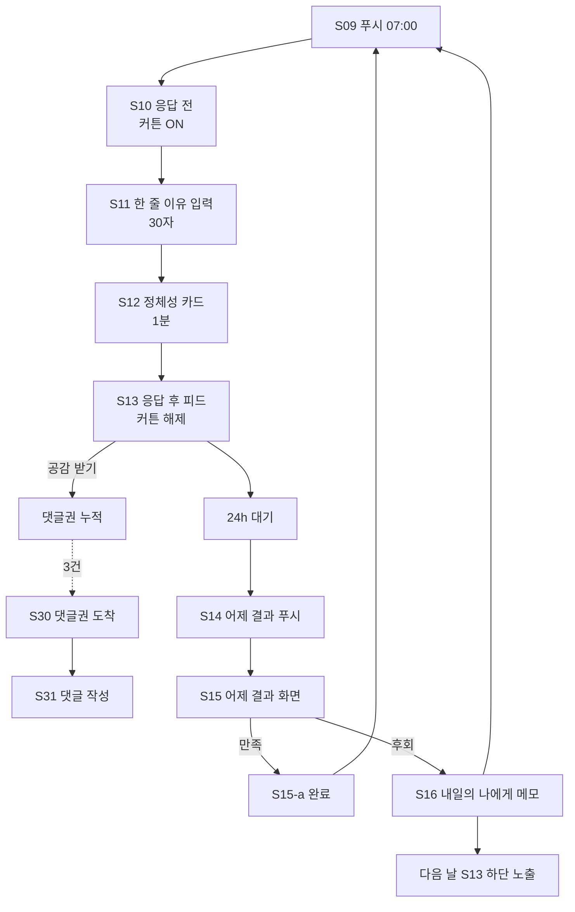
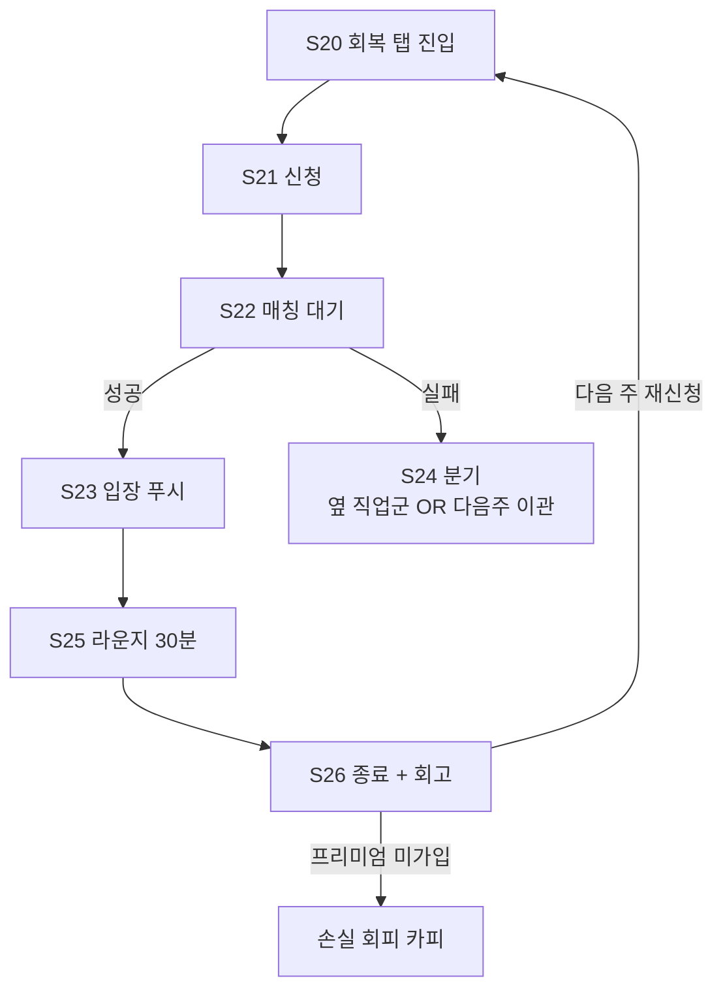

# 동네맘 — UX 플로우 & 정보 구조

> 본 문서는 `docs/01-concept.md`와 `.claude/knowledge/momcafe/project-context.md`(헌법)를 *그대로 둔 채* 사용자 흐름과 화면 단위로 분해한 설계서다.
> UI 디자이너는 본 문서의 **화면 ID (S#)** 를 받아 와이어프레임을 짠다. 시각 디테일은 UI 디자이너 몫.

---

## 0. 설계 원칙 (모든 화면의 공통 제약)

| # | 원칙 | 화면 설계에 미치는 영향 |
|---|---|---|
| P1 | 한 화면 머무는 시간 *최대 1~3분* | 스크롤 한 번 이상 필요한 화면은 *분할*한다. |
| P2 | 30초 응답이 메인 — 그 이상 요구 금지 | 메인 응답 화면 입력 필드는 *A/B 1탭 + 한 줄 30자 이내* 만. |
| P3 | 응답 전에는 다른 사람 결과 *비공개 (커튼)* | 응답 전 모든 화면에서 통계·여론 표시 금지. |
| P4 | 게시판/자유게시글 만들지 마라 | 최상위 IA에 "게시판/검색/태그" 진입점 *부재*. |
| P5 | 광고 배너 자리 만들지 마라 | 상·하단 띠광고/스폰서드 슬롯 *부재*. |
| P6 | "○○맘"이 아니라 *예전의 나*로 호명 | 모든 호칭 변수는 `{결혼전이름}` + `{전공/직업}`. "○○ 엄마"는 시스템 어디에도 표기 금지. |
| P7 | 데이터 동의는 호혜성 프레임으로 | "내 결정이 동네 의사결정에 도움이 됩니다" 1문장이 모든 데이터 수집 화면의 헤더. |

---

## 1. 정보 구조 (IA)

### 1-1. 최상위 구조

앱은 **3탭** 만 둔다. 게시판이 아니므로 검색/태그/카테고리 탭은 *없다*.

```
[루트]
 ├─ 탭1. 오늘 (Today)            ← 기본 진입. 일일 의식의 입구.
 │    ├─ 오늘의 결정 (응답 전/후로 화면 다름)
 │    ├─ 어제의 결과 (24h 회수)
 │    └─ 내 한 줄 이유의 공감 알림 (인-탭 배지)
 │
 ├─ 탭2. 회복 (Identity)         ← 정체성 회복 전용.
 │    ├─ 이름 회복실 (주 1회 30분)
 │    ├─ 내 호명 카드 (예전 이름/전공)
 │    └─ 프리미엄 (월 9,900원 무제한·1:1)
 │
 └─ 탭3. 나 (Me)                 ← 가벼운 마이페이지.
      ├─ 내 결정 히스토리 (어제→오늘 후회율 추이)
      ├─ 내가 남긴 "내일의 나에게" 메모
      ├─ 받은 공감 / 댓글권
      └─ 설정 (푸시 시간 고정 7시, 동네, 탈퇴)
```

### 1-2. 모달/시트로만 뜨는 보조 화면 (탭 아님)

- **정체성 회복 카드** — 응답 직후 1분 풀스크린 (탭 외)
- **이름 회복실 라운지** — 매칭 성공 시 풀스크린 전용 모드
- **내일의 나에게 메모 작성** — 결과 확인 직후 인라인 시트

### 1-3. 검색·게시판 부재의 명시

> 헌법 P4 강제. 상단 검색 아이콘, 카테고리 메뉴, 글쓰기 FAB 모두 *없다*. 신규 사용자가 "어디서 글 써요?"라고 묻는 것이 정상이다. 그 질문 자체가 *오늘의 결정*으로 유도된다.

---

## 2. 온보딩 · 가입 플로우

### 2-1. 목표

- 정체성 데이터 (*결혼 전 이름·직업/전공·취미*)를 받는다 — 모방 불가 자산.
- 그러나 *부담*은 0에 가깝게. 호혜성 프레임으로 동의를 *얻는 게 아니라 끌어낸다*.
- **첫 결정 응답까지** 5분 이내. 가입 자체가 목표가 아니라 *첫 응답*이 목표.

### 2-2. 단계별 화면

```
S01 스플래시 / 한 줄 선언
    "당신의 오늘 한 결정을, 같은 동네 엄마들과 같이 내립니다."
       │
       ▼
S02 동네 선택 (강서구 고정 — 시범)
    " 어디서 결정을 같이 내릴까요? "
    [강서구 선택] (다른 동네는 "대기 명단" CTA만)
       │
       ▼
S03 호혜성 프레임 화면 (정체성 데이터 수집의 *왜*)
    "다음 4가지를 알려주시면,
     같은 처지의 12명이 오늘 내린 결정을
     당신에게도 보여드립니다."
    *  이름 부분은 "결혼 전 이름"으로 호명되는
       1분짜리 카드를 매일 받기 위해서입니다.
    [동의하고 시작]   [지금은 패스]    ← 패스 시 S07로 점프, 정체성 카드 미발급 상태로 진입 (엣지 케이스 E1 참조)
       │
       ▼
S04 정체성 데이터 입력 ①    "결혼 전, 사람들이 당신을 뭐라고 불렀나요?"
    - 결혼 전 이름 (한글 1~6자) — 닉네임 아님, 호명용
    - 다음 (Skip 버튼 *없음*. 단 S03에서 "패스"는 가능)
       │
       ▼
S05 정체성 데이터 입력 ②    "그 시절, 당신을 한 줄로 소개한다면?"
    - 직업 [선택형 18개 + 직접 입력] (예: 디자이너/간호사/교사/연구원…)
    - 전공 [선택형 + 직접 입력]
    - 취미 1개 (선택)
       │
       ▼
S06 자녀 컨텍스트 (1화면 — 4초)
    "마지막. 오늘의 결정을 *같은 또래 엄마*와 묶기 위해서만 씁니다."
    - 자녀 연령 (3·4·5·6·7세) — 다중 선택 가능
    - 자녀 수는 묻지 않음 (불필요)
       │
       ▼
S07 푸시 알림 권한 — 7시 고정 프레임
    "매일 아침 7시, 단 1회.
     출근 준비하시는 동안 30초만 봐주세요."
    [허용]    [나중에]   ← 나중에 누른 경우 S08에서 인앱 알림으로 대체
       │
       ▼
S08 첫 진입 — "오늘의 결정" 인입
    바로 S10 (오늘의 결정 응답 전) 으로.
```

### 2-3. 심리 레버 매핑 (온보딩)

| 단계 | 레버 | 작동 방식 |
|---|---|---|
| S03 | #7 호혜성 | 받기 전에 *왜 주는지*를 먼저 보여 데이터 동의를 끌어냄 |
| S03 | #11 호기심 갭 | "12명이 오늘 내린 결정" — 안 보면 못 보는 것 |
| S04~S05 | 신규 B 정체성 회복 (예고) | 입력 자체가 "예전의 나"를 떠올리는 트리거 |
| S07 | #3 손실 회피 | "단 1회·30초" — 거절의 비용을 낮춤 (= 허용 비용도 낮음) |

### 2-4. 측정 지표

- **S03 동의율** (호혜성 프레임이 작동하는가) — 목표 70%↑
- **S05 직업/전공 입력 완료율** — 목표 60%↑ (패스해도 가입 자체는 통과)
- **온보딩 → 첫 응답 (S10→S11) 완주율** — 목표 50%↑
- **온보딩 평균 소요 시간** — 4분 이하 (넘으면 S04~S06 단축)

---

## 3. 메인 일일 루프 (가장 중요)

### 3-1. 시간축 전체 그림

```
[D-day 06:59]                                                  [D+1 07:00]
     │                                                              │
     │    푸시1                  응답 30초                  푸시2
     │     ▼                       ▼                          ▼
─────┼────[07:00]────────────[07:00~07:01]──────...──────[07:00]─────────▶
     │     │                       │                          │
     │   S09 푸시            S10 응답 전              S14 어제의 결과 푸시
     │   알림 카드          → S11 응답 화면          → S15 결과 화면
     │                      → S12 정체성 카드 (1분)        → S16 후회 메모 작성
     │                      → S13 응답 후 결과/공감
```

### 3-2. 화면 흐름 상세

```
[D-day 07:00 — 푸시]
S09  푸시 알림
     제목: "{결혼전이름}님, 오늘의 결정."
     본문: "이번 주말 키즈카페 vs 도서관 — 같은 동네 7세 엄마 47명이 고민 중."
     탭 → S10
        │
        ▼
S10  오늘의 결정 — 응답 전 (커튼 ON, P3 강제)
     - 헤더: "오늘 강서구 7세 엄마들의 결정"
     - 본문 카드: 질문 1문장 + 맥락 1문장 (예: "이번 주말, A 키즈카페 / B 도서관")
     - *통계·여론은 절대 노출되지 않음* (커튼)
     - A/B 두 개의 큰 버튼 + 본문 아래 "한 줄 이유 입력 (선택)" 30자
     - 하단: "응답 후 같은 직업이었던 엄마들의 선택을 보여드립니다" (호기심 갭 예고)
        │  A 또는 B 탭
        ▼
S11  한 줄 이유 입력 — 인라인
     - "A를 고른 이유, 한 줄만." (30자 카운터, 빈 채로 제출 가능)
     - [응답 완료]  ← 제출 즉시 S12로 *전환 애니메이션 0.6초*
        │
        ▼
S12  정체성 회복 카드 (풀스크린 1분, *레버 B의 핵심 순간*)
     -----------------------------------------------
       오늘 {결혼전이름}님의 선택은 [A]입니다.

       예전 {직업/전공}이셨던 다른 엄마
       12명도 오늘 [A]를 골랐어요.

       — 디자이너였던 당신,
         오늘도 안목이 통했네요.
     -----------------------------------------------
     - 1분 후 자동 닫힘 OR [닫고 결과 보기] 탭
     - *체류는 1분이 상한*. 길게 머물면 도리어 이탈 (P1).
        │
        ▼
S13  응답 후 — 동네 결과 + 한 줄 이유 피드
     - 상단: "강서구 7세 엄마 47명 중 — A 31명 / B 16명" (커튼 해제)
     - 본문: 다른 사람들의 *한 줄 이유* 카드 리스트 (정렬: 공감 많은 순)
       └ 각 카드에 [공감] [다시 생각] 두 버튼
     - 내 한 줄 이유는 상단 핀 고정 ("내가 쓴 한 줄")
     - 하단: "어제 같은 결정을 한 누군가가 남긴 메모" (4-β, 있을 때만 노출)
        │
        ▼ (탭하면)
S13-a 다른 한 줄 이유에 공감/다시 생각 1탭 → 즉시 반영
     - 같은 화면 안에서 처리. 페이지 이동 없음.
     - 신입은 *읽기만 해도 가치를 얻는다*. (헌법 P4 — 발언권 0 문제의 첫 완화)

[24h 후 — D+1 07:00]
S14  어제의 결과 푸시
     본문: "어제 A를 고른 31명 중 19명이 '만족', 12명이 '후회'."
     탭 → S15
        │
        ▼
S15  어제의 결과 화면
     - 상단: 후회율 그래프 (간단한 막대 1줄)
     - "후회 이유 1위: ○○" — 텍스트 클러스터 1줄
     - 내 어제 응답: [A / 만족? 후회?] 한 탭 입력
        │
        ├─ 만족 탭 → S15-a "수고하셨어요. 오늘의 결정으로." → S10 진입
        │
        └─ 후회 탭 → S16
                       │
                       ▼
S16  내일의 나에게 메모 작성 (4-β)
     - 상단: "내일 같은 결정을 할 누군가에게 한 마디"
     - 입력: 60자 이내 1줄
     - [건너뛰기]  [남기기]
     - 남긴 메모는 *내일 같은 질문을 받는 엄마*의 S13 하단에 노출됨 (시간 차 호혜성)
        │
        ▼
     S10 (오늘의 결정) 진입
```

### 3-3. 심리 레버 매핑 (메인 루프)

| 화면 | 레버 | 작동 방식 |
|---|---|---|
| S09 푸시 | #11 호기심 갭 | "47명이 고민 중" — 안 들어가면 못 봄 |
| S10 응답 전 | 신규 A 대리 결정 | 내 결정을 집단 결정으로 *옮기는* 입구 |
| S10 응답 전 | P3 커튼 | 동조 편향 차단 — 결정의 *진정성* 보존 |
| S11 한 줄 이유 | #2 인정 (예고) | 한 줄 이유는 *공감받을 자원* |
| S12 정체성 카드 | 신규 B 정체성 회복 | 핵심 락인 순간 — 1분의 *나* |
| S12 | #2 인정 | "안목이 통했네요" 마이크로 카피 |
| S13 결과 피드 | #11 호기심 갭 (해소) | 응답 후 드디어 여론 노출 — *보상* 구조 |
| S13 공감 버튼 | #7 호혜성 | 받은 공감은 댓글권으로 (섹션 6) |
| S14 푸시 | #11 호기심 갭 | "어제 결정의 결말" — 변동 보상 |
| S16 메모 | #7 호혜성 (시간차) | 어제의 나 → 내일의 누군가 |
| S16 메모 | 신규 B 정체성 회복 | 후회의 *주체*가 되는 행위 |

### 3-4. 측정 지표

- **S09 → S10 전환율** (푸시 오픈율) — 목표 35%↑
- **S10 → S11 응답 완료율** — 목표 80%↑ (들어왔으면 답한다)
- **S11 한 줄 이유 입력률** — 목표 40%↑
- **S12 평균 체류 시간** — 30~60초 (P1 위반은 90초↑)
- **S13 공감 1회 이상 클릭률** — 목표 30%↑
- **S14 → S15 회수율 (D+1)** — 목표 30%↑
- **D+1 회수까지 도달한 사용자의 D+7 재방문** — 목표 50%↑ (락인 지표)
- **S16 후회 메모 작성률** (후회 응답자 중)— 목표 25%↑

---

## 4. 이름 회복실 플로우 (보조 4-α)

### 4-1. 목표

- 주 1회 30분, *결혼 전 이름·전공*만으로 4명과 익명 라운지.
- 자녀·남편·시댁 얘기 *금지*가 유일 규칙.
- 무료 주 1회 / 무제한·1:1 매칭은 **월 9,900원 프리미엄** (헌법 수익 #3).

### 4-2. 화면 흐름

```
S20 회복 탭 진입 — 이번 주 회복실 카드
    - "이번 주 회복실: 토요일 21:00 시작 / 30분"
    - 신청 상태 표시: [신청하지 않음] / [신청 완료] / [매칭 대기 중] / [라운지 입장 가능]
    - 하단: 프리미엄 안내 카드 ("매주 한 시간, 나로 살기" — 손실 회피 프레이밍)
       │
       ▼
S21 신청 화면
    - "오늘 누구로 자기소개하시겠어요?"
    - 자동 표시: 가입 시 입력한 {결혼전이름} / {직업} / {전공}
    - [수정하기] (1회 수정 가능)
    - [신청하기]
       │
       ▼
S22 매칭 대기 (별도 페이지 X, 푸시 + 탭 배지)
    - 같은 동네 + 같은 옛 직업군(또는 전공군) 4명 매칭 시도 (-30분 전부터)
    - 매칭 성공 → S23 푸시
    - 매칭 실패 → S24 분기 (엣지 케이스 E2 참조)
       │
       ▼
S23 라운지 입장 푸시 (시작 5분 전)
    "{결혼전이름}님, 5분 후 회복실이 열립니다."
    탭 → S25
       │
       ▼
S25 라운지 (풀스크린 모드, 30분 카운트다운)
    - 상단: 30:00 카운트다운 + 4명의 *예전 이름·전공* 카드
    - 본문: 텍스트 채팅 (음성은 v2)
    - 하단 고정 배너: "자녀·남편·시댁 얘기는 잠시 접어두세요."
    - 룰 위반 시 자동 워닝 (키워드 감지 v2; v1은 신고 1버튼)
    - 30분 후 자동 종료 → S26
       │
       ▼
S26 라운지 종료 화면 (1분 회고)
    - "오늘 30분, {결혼전이름}으로 사셨네요."
    - [다음 주 신청 예약]   [닫기]
    - 프리미엄 미가입자에겐: "다음 주를 기다리지 않으려면…" (손실 회피)
```

### 4-3. 분기

```
S24 매칭 실패 분기
    - 4명 미달 시 (같은 동네·같은 직업군 응답풀 부족)
       ├─ A: "옆 직업군과 매칭하시겠어요?" — 사용자 동의 시 진행
       └─ B: "다음 주로 자동 이관" — 신청권 보존
    - 둘 다 결과를 *푸시로 통보* (앱 재진입 강요 금지)
```

### 4-4. 심리 레버 매핑

| 화면 | 레버 | 작동 방식 |
|---|---|---|
| S20 | #3 손실 회피 | "이번 주 자리 한정" |
| S20 | 신규 B 정체성 회복 | 회복실 자체가 레버 B의 *순도 100%* 구현 |
| S21 | #10 통제감 | 자기소개 *수정 1회* 권한 — 선택 환상 |
| S25 | #6 소속 | 같은 옛 직업/전공이라는 *수평 동료* (결핍 #5 해소) |
| S26 | #3 손실 회피 + #9 매몰비용 | "30분 보냈는데 다음 주도 보고싶다" → 프리미엄 |

### 4-5. 측정 지표

- **S20 진입 → S21 신청 완료율** — 목표 15%↑ (전체 사용자 중)
- **S22 매칭 성공률** — 목표 70%↑
- **S25 30분 끝까지 체류율** — 목표 80%↑
- **S26 → 다음 주 재신청률** — 목표 60%↑
- **무료 4회 사용한 사용자의 프리미엄 전환율** — 목표 8%↑

---

## 5. 내일의 나에게 추천 플로우 (보조 4-β)

### 5-1. 목표

- 어제 *후회한 사람*이 *오늘 같은 결정을 할 사람*에게 메모를 남긴다.
- 메모는 시간 차 호혜성 — 내가 받은 게 아니라 *내가 줬던 게 돌아오는* 구조.

### 5-2. 화면 흐름 (메인 루프와 결합)

```
[작성 측 — 어제 후회한 사용자]
S15 어제의 결과 → "후회" 탭 → S16 메모 작성
    - 60자 1줄
    - 익명. 단 카드 상단에 {예전 직업} 1줄 표기 ("디자이너였던 누군가가 남긴 메모")
    - 작성 후 → S15-b "당신의 메모가 내일 누군가의 결정을 도울 거예요." (호혜성 환기)

[수령 측 — 오늘 같은 결정을 받은 사용자]
S13 응답 후 결과 화면 하단
    - "어제 같은 결정을 한 디자이너였던 엄마의 메모"
    - 카드 1개만 노출 (피드 안 만듦 — P4 게시판화 방지)
    - 매칭 규칙:
       (1) 같은 질문에 어제 응답한 사람 중
       (2) "후회"로 답하고
       (3) {직업/전공}이 같은 사람의 메모 1개 (없으면 같은 동네 후회자 메모)
    - 카드에는 [고마워요] 1탭만 (댓글 못 답)
       │
       ▼
S13-c [고마워요] 탭 시
    - 메모 작성자에게 *알림 1건* — "디자이너였던 당신의 메모에 한 분이 고마워했어요."
    - 이게 메모 작성자의 다음 후회 메모 작성 트리거가 됨 (인정 #2)
```

### 5-3. 심리 레버 매핑

| 화면 | 레버 | 작동 방식 |
|---|---|---|
| S16 작성 | #7 호혜성 (시간차) | 받은 사람이 갚는 게 아니라 *준 사람이 돌려받음* |
| S16 작성 | 신규 B 정체성 회복 | 후회의 *해석자*가 됨 — 약자에서 가이드로 |
| S13-c | #2 인정 | "고마워요" 1탭이 작성자에게 도파민 |

### 5-4. 측정 지표

- **S16 후회 응답자의 메모 작성률** — 목표 25%↑
- **S13 노출된 메모의 [고마워요] 클릭률** — 목표 30%↑
- **메모 작성 → 다음 주 메모 재작성률** (인정 루프) — 목표 40%↑

---

## 6. 공감 → 댓글권 획득 플로우 (신입 발언권 0 해결)

### 6-1. 목표

- 헌법 P4·#4 — 신입도 *한 줄 이유 한 번*으로 발언권을 얻을 수 있다.
- 댓글권은 *공감 받은 사람*에게만 부여 (보상 구조). 등급제 아님.

### 6-2. 흐름

```
[Day N — 신입의 첫 응답]
S11 한 줄 이유 입력 — 30자
       │
       ▼
S13 결과 피드에 내 한 줄 이유가 노출됨
    └ 다른 사용자가 [공감] 탭

[Day N — 공감 누적]
- 1건 공감 → 미니 토스트 ("당신의 한 줄에 공감 1.")
- *3건 공감 누적* → "댓글권 1장이 도착했어요" 푸시 (or 인앱 알림)

[Day N — 댓글권 사용]
S30 댓글권 알림 → 탭
    - "지금 강서구에서 진행 중인 다른 결정의 한 줄 이유에 댓글 1번 달 수 있어요."
    - [지금 사용]   [내일까지 보관]   ← 내일까지 미사용 시 소멸 (손실 회피)
       │
       ▼
S31 댓글 가능한 한 줄 이유 리스트 (오늘의 결정 한정)
    - 댓글권 1장당 1개 한 줄 이유에 댓글 1회
    - 댓글은 60자, 익명 + 예전 직업/전공만 노출
       │
       ▼
S32 댓글 게시 완료 → 토스트 1줄
```

### 6-3. 왜 이 구조여야 하는가

- 등급/포인트제를 *피한다* (헌법 — 등급제 금지). 댓글권은 *1회용 티켓*이다.
- 글 많이 쓰는 사람이 영주가 되지 않는다. 매번 공감을 *새로* 받아야 댓글권을 다시 얻는다.
- 신입에게 *불공평하지 않다*. 한 줄 이유는 *글 길이가 아니라 통찰*로 평가됨 (= 신입도 가능).

### 6-4. 심리 레버 매핑

| 단계 | 레버 | 작동 방식 |
|---|---|---|
| S13 공감 받기 | #2 인정 | 도파민 1차 |
| 댓글권 획득 | #7 호혜성 | 받은 공감 → 발언권 |
| 댓글권 소멸 시한 (24h) | #3 손실 회피 | "안 쓰면 사라짐" → 재진입 |
| 댓글 작성 | #10 통제감 | 1회용 티켓이지만 *내가 선택해서 씀* |

### 6-5. 측정 지표

- **신입(가입 7일 이내)의 한 줄 이유 공감 1회 이상 받음 비율** — 목표 30%↑
- **댓글권 획득 → 24h 내 사용률** — 목표 60%↑
- **댓글권 첫 사용자의 D+7 재방문** — 목표 70%↑ (락인 검증)

---

## 7. 전체 화면 ID 인덱스 (UI 디자이너 핸드오프용)

| ID | 화면 이름 | 카테고리 | 모드 |
|---|---|---|---|
| S01 | 스플래시 / 한 줄 선언 | 온보딩 | 풀스크린 |
| S02 | 동네 선택 | 온보딩 | 풀스크린 |
| S03 | 호혜성 프레임 (왜 데이터를 받는가) | 온보딩 | 풀스크린 |
| S04 | 결혼 전 이름 입력 | 온보딩 | 풀스크린 |
| S05 | 직업·전공·취미 입력 | 온보딩 | 풀스크린 |
| S06 | 자녀 연령 입력 | 온보딩 | 풀스크린 |
| S07 | 푸시 권한 요청 | 온보딩 | 풀스크린 |
| S08 | 첫 진입 트랜지션 | 온보딩 | 트랜지션 |
| S09 | 오늘의 결정 푸시 | 일일 루프 | OS 알림 |
| S10 | 오늘의 결정 — 응답 전 (커튼) | 일일 루프 | 메인 탭 |
| S11 | 한 줄 이유 입력 | 일일 루프 | 인라인 시트 |
| S12 | 정체성 회복 카드 (1분) | 일일 루프 | 풀스크린 모달 |
| S13 | 응답 후 결과 피드 | 일일 루프 | 메인 탭 |
| S13-a | 한 줄 이유 공감/다시 생각 | 일일 루프 | 인라인 |
| S13-c | 메모 [고마워요] 액션 | 일일 루프 (4-β) | 인라인 |
| S14 | 어제의 결과 푸시 | 일일 루프 | OS 알림 |
| S15 | 어제의 결과 화면 | 일일 루프 | 메인 탭 |
| S15-a | 만족 완료 화면 | 일일 루프 | 트랜지션 |
| S15-b | 메모 작성 완료 화면 | 일일 루프 | 트랜지션 |
| S16 | 내일의 나에게 메모 작성 | 일일 루프 (4-β) | 인라인 시트 |
| S20 | 회복 탭 — 이번 주 회복실 카드 | 4-α | 메인 탭 |
| S21 | 회복실 신청 | 4-α | 모달 |
| S22 | 매칭 대기 (상태 배지) | 4-α | 탭 배지 |
| S23 | 라운지 입장 푸시 | 4-α | OS 알림 |
| S24 | 매칭 실패 분기 | 4-α (엣지) | 푸시 + 모달 |
| S25 | 라운지 (30분) | 4-α | 풀스크린 모드 |
| S26 | 라운지 종료 화면 | 4-α | 풀스크린 |
| S30 | 댓글권 도착 알림 | 댓글권 | 인앱 알림 |
| S31 | 댓글 가능한 한 줄 이유 리스트 | 댓글권 | 풀스크린 |
| S32 | 댓글 게시 완료 | 댓글권 | 토스트 |
| S40 | 나 탭 — 결정 히스토리 | 마이 | 메인 탭 |
| S41 | 나 탭 — 내 메모 모음 | 마이 | 서브 |
| S42 | 나 탭 — 받은 공감/댓글권 | 마이 | 서브 |
| S43 | 나 탭 — 설정 | 마이 | 서브 |

---

## 8. 엣지 케이스

### E1. 정체성 데이터 미입력 사용자 (S03에서 패스)

- **상태**: 결혼 전 이름/직업 없음. S12 정체성 카드 *발급 불가*.
- **대응 화면**: S12 자리에 **S12-empty** — "오늘 당신의 선택은 [A]입니다. — 당신이 누구였는지 아직 모릅니다. [예전의 나 알려주기]" 1버튼.
- **목적**: 패스했다고 차단하지 않음. 단 *호기심 갭*으로 후입력 유도 (#11).
- **측정**: S12-empty → S04 후입력 전환율. 목표 20%↑.

### E2. 같은 동네 응답풀 50명 미만 (헌법 — 50명 미만 데이터 미집계)

- **상태**: 강서구 응답자 50명 미만인 초기 N주.
- **대응**:
  - S10 응답 전 헤더에 "오늘 강서구 *함께 결정 중*: 23명" (정직 표기)
  - S13 결과 피드는 정상 노출 (커튼 해제는 동일)
  - 단 외부 데이터 자산화 (B2B 리포트)에는 50명 미만 결정 *제외* — 사용자 UI에는 영향 없음, 백엔드 정책
- **메시지**: "동네 응답이 더 모이면 *후회율*도 알려드려요." (호기심 갭으로 가입자 모집 동력)

### E3. 회복실 매칭 4명 미달 (S24)

- 4-3절 참조. 자동 푸시 통보. 앱 강제 재진입 없음.

### E4. 새벽 응답 / 7시 푸시 못 본 사용자

- 7시 푸시 미오픈 시 점심 12시에 *조용한 인앱 알림* 1회 (푸시 X — P6 1일 1푸시 원칙). 그 이후엔 D+1로 넘김.
- 결정은 *그 날 안에만 응답 가능*. 지난 결정은 결과(S15)만 볼 수 있음.

### E5. 한 줄 이유 0건 응답자

- A/B만 누르고 한 줄 이유 미입력 = 정상. S12 정체성 카드는 *동일하게* 발급. 단 S13 피드에 내 카드 노출은 없음 (= 공감 받을 자원 0).
- 시스템은 *이유 입력*을 강요하지 않는다. P2 (30초 응답이 메인).

### E6. 정체성 데이터의 *적성에 안 맞는* 직업군

- 직업 선택지 18개 외 *직접 입력* 허용. 단 같은 동네 + 같은 직업군 매칭에서 자유 입력 직업은 "기타군"으로 묶임 (회복실 매칭 시 안내 1줄).

### E7. 첫 푸시(S09) 권한 거부

- S07에서 거부 시 S09 푸시 없음. 인앱 알림과 *아침 7시 앱 아이콘 뱃지 1개*로 대체. 푸시 권한 재요청은 D+3에 *결정 결과를 못 받은 손실*을 보여주는 화면에서 한 번 더 (손실 회피).

---

## 9. 다음 단계 (UI 디자이너에게 넘기는 핸드오프 메모)

UI 디자이너는 다음을 받는다:

- **본 문서 (S01~S43 화면 ID 인덱스)** — 어떤 화면을 그릴지 목록 확정.
- **글로벌 디자인 시스템** (`C:/Users/Administrator/.claude/knowledge/ui-designer/design-system.md`) — 레이아웃·간격·인터랙션·전환 애니메이션 기준.
- **각 화면의 *필수 / 금지 / 주의* 요소** (아래 표).

### 9-1. 화면별 필수 / 금지 / 주의 (요약)

| 화면 | 필수 | 금지 | 주의 |
|---|---|---|---|
| S10 응답 전 | A/B 큰 버튼, 한 줄 이유 옵션 입력, 호기심 갭 1줄 | 통계·여론 노출 (커튼 P3), 게시판 진입 아이콘 | 동조 편향 차단 — 다른 사람 응답 *0% 노출* |
| S12 정체성 카드 | {결혼전이름} + {직업/전공}으로 호명, 1분 카운트다운 또는 1탭 닫기 | "○○맘" 호칭 (P6 위반), 광고 슬롯 | 1분 상한. 길게 머물면 도리어 어색해짐 |
| S13 응답 후 | 동네 결과 통계, 한 줄 이유 카드 리스트, 어제 메모 1장(있을 때) | 무한 스크롤, 게시판화 (P4), 댓글창 (댓글권 보유자만 S31에서) | 정렬은 *공감 많은 순* 디폴트 |
| S16 메모 작성 | 60자 단일 입력, 익명 + 직업/전공만 노출 | 신원/연락처/링크 입력, 자녀 이름 입력 | 입력 후 즉시 "고마움이 내일 도착합니다" 한 줄 |
| S25 라운지 | 30분 카운트다운, 4명 카드, 텍스트 채팅, 룰 배너 | 자녀·남편·시댁 키워드, 사진 첨부 (v1) | 위반 시 자동 워닝 (v2) / v1은 신고 버튼 |
| S31 댓글 작성 | 60자 단일, {직업/전공}만 노출 | 익명 외 ID 노출, 자유 게시판 진입 | 댓글권 1장 사용 = 1회 댓글만 |
| 전역 | 1일 1푸시 (7시), 한 화면 1~3분 체류 상한, 호혜성 프레임 헤더 | 검색·태그·카테고리 탭, 광고 배너, 등급/포인트 UI | 마찰 일부는 *의도된 결제 유도* — 회복실 무료 1회 제한, 댓글권 24h 소멸 등 |

### 9-2. 한 줄로

> *시각이 아니라 흐름을 먼저 검토해라. 게시판 패턴(피드/검색/카테고리/광고 배너)을 손이 그리려 하면 멈춰라. 본 문서의 S 번호 인덱스에 없는 화면은 그리지 않는다.*

---

## 부록 A — 플로우 다이어그램 (Mermaid)





---

*문서 종료. UI 디자이너 작업 전 본 문서와 design-system.md를 함께 읽을 것.*
